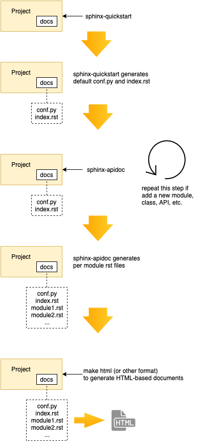

================================================
Hilfe für RST files und Google style docstrings
================================================
  Mehr Information bei `sphinx-doc.org <https://www.sphinx-doc.org/en/master/usage/restructuredtext/index.html>`_ und `shunsvineyard.info <https://shunsvineyard.info/2019/09/19/use-sphinx-for-python-documentation/>`_

Workflow
---------

Konfiguration (conf.py)
------------------------

Damit die Source-Files gefunden werden muss das Verzeichnis im Pfad sein.

.. code-block:: python

  # -- Path setup --------------------------------------------------------------

  # If extensions (or modules to document with autodoc) are in another directory,
  # add these directories to sys.path here. If the directory is relative to the
  # documentation root, use os.path.abspath to make it absolute, like shown here.
  #
  import os
  import sys
  sys.path.insert(0, os.path.abspath('../src'))

Um auch Kommentare im "Google Style" zu erkennen muss die Extention `napoleon` hinzugefügt werden. Sie ist Teil der `Spinx` Installation.

.. code-block:: python

  # Add any Sphinx extension module names here, as strings. They can be
  # extensions coming with Sphinx (named 'sphinx.ext.*') or your custom
  # ones.
  extensions = [
      'sphinx.ext.autodoc',
      'sphinx.ext.napoleon',
      'sphinx.ext.doctest',
      'sphinx.ext.todo',
      'sphinx.ext.coverage',
      'sphinx.ext.mathjax',
      'sphinx.ext.viewcode',
      'sphinx.ext.githubpages',
  ]
  
Damit die erzeugten HTML-Dateien nicht im Git-Repository landen sollte in der Datei `.gitignore` das Verzeichnis `docs_src/build` ausgeschlossen werden.

Anwendung
----------

Mittels der Batch datei ``makedocs.bat`` wird die Code-Dokumentation im konfigurierten Ausgabeverzeichnis erzeugt
(.\docs_src\_build\html). Die gesamte Dokumentation, einschließlich der MKDocs-Seiten, wird durch aufrufen der 
Batch-Datei mit dem Parameter ``all`` erzeugt (``makedoc.bat all``) und auf den Dokumentationsserver ins 
Verzeichnis %TARGETDIR% (\\\\kplanas01\\web\\docs\\infra-PLS\\Brandmaier\\src) kopiert.

.. code-block:: bat
  :caption: makedoc.bat

  @ECHO OFF

  pushd %~dp0
  
  REM Command file for Sphinx documentation
  
  if "%SPHINXBUILD%" == "" (
    set SPHINXBUILD=sphinx-build
  )
  
  if "%SHPINXAPIDOC%" == "" (
    set SHPINXAPIDOC=sphinx-apidoc
  )
  
  set SRC=src
  set SOURCEDIR=docs_src
  set BUILDDIR=docs_src\build
  set TARGETDIR=\\kplanas01\web\docs\infra-PLS\Brandmaier\src
  
  %SPHINXBUILD% >NUL 2>NUL
  if errorlevel 9009 (
    echo.
    echo.The 'sphinx-build' command was not found. Make sure you have Sphinx
    echo.installed, then set the SPHINXBUILD environment variable to point
    echo.to the full path of the 'sphinx-build' executable. Alternatively you
    echo.may add the Sphinx directory to PATH.
    echo.
    echo.If you don't have Sphinx installed, grab it from
    echo.http://sphinx-doc.org/
    exit /b 1
  )
  
  %SHPINXAPIDOC% -f .\%SRC% -o .\%SOURCEDIR%
  %SPHINXBUILD% -M html %SOURCEDIR% %BUILDDIR% -a %SPHINXOPTS%
  
  if "%1"  neq "all" goto end
  rem Make mkdocs also
  mkdocs build
  xcopy  /S /E %BUILDDIR%\html\* %TARGETDIR%\*
  goto end
  
  :help
  %SPHINXBUILD% -M help %SOURCEDIR% %BUILDDIR% %SPHINXOPTS%
  
  :end
  popd
  

Überschriften und Sektionen
----------------------------

Für den Titel des Dokuments wird eine Linie mit dem `=` Zeichen darüber und darunter verwendet. Danach wird nur eine 
Linie daruter verwendet. Für die Linien werden die Zeichen ``=-~"'^#*$`+;.,_/%&!`` in dieser Reihenfolge verwendet.
Die Zeile `.. _header1:` erzeugt 

.. code-block:: rst
  :caption: code-blocks

  ========
  DocTitle
  ========

  Then use underlining only:

  .. _header1:

  Header 1
  ========

  Header 1.1
  ----------

  Header 1.1.1
  ~~~~~~~~~~~~

  Header 1.1.1.1
  """"""""""""""

Inline Formatierung
--------------------

Mathematische Forrmeln
~~~~~~~~~~~~~~~~~~~~~~

.. code-block:: rst
  :caption: math

  :math:`A_\text{c} = (\pi/4) d^2`

:math:`A_\text{c} = (\pi/4) d^2`

Tasten
~~~~~~~

.. code-block:: rst
  :caption: kbd

  Press :kbd:`ctrl` + :kbd:`s`

Press :kbd:`ctrl` + :kbd:`s`

Abkürzungen
~~~~~~~~~~~~

.. code-block:: rst
  :caption: abbr

  Beim überstreichen von :abbr:`LIFO (Last In, First OPut)` wird eine Erklärung für die Abkürzung angezeigt.

Beim überstreichen von :abbr:`LIFO (Last In, First OPut)` wird eine Erklärung für die Abkürzung angezeigt.

Bilder
~~~~~~

.. code-block:: rst
  :caption: image

  .. image:: ../../docs/img/favicon256.png

.. image:: ../../docs/img/favicon256.png

.. code-block:: rst
  :caption: image

  .. image:: ../../docs/img/favicon256.png
    :alt: Alternativer Bild text
    :width: 100px

.. image:: ../../docs/img/favicon256.png
  :alt: Alternativer Bild text
  :width: 100px

.. code-block:: rst
  :caption: figure

  .. figure:: ../../docs/img/favicon256.png
    :alt: Alternativer Bild text
    :width: 100px

    Dies ist die Bildbeschreibung

.. figure:: ../../docs/img/favicon256.png
  :alt: Alternativer Bild text
  :width: 100px

  Dies ist die Bildbeschreibung

Hinweise
~~~~~~~~~

.. code-block:: rst
  :caption: note

  .. note::
    Dies ist eine Bemerkung

.. note::
  Dies ist eine Bemerkung

.. code-block:: rst
  :caption: tip

  .. tip::
    Dies ist ein Tip

.. tip::
  Dies ist ein Tip

.. code-block:: rst
  :caption: important

  .. important::
    Dies ist ein wichtiger Hinweis.

.. important::
  Dies ist ein wichtiger Hinweis.

.. code-block:: rst
  :caption: warning

  .. warning::
    Dies ist eine Warnung.

.. warning::
  Dies ist eine Warnung.

.. code-block:: rst
  :caption: attention

  .. attention::
    Dies ist eine Warnung (ACHTUNG!).

.. attention::
  Dies ist eine Warnung (ACHTUNG!).

Tabelle
--------

.. code-block:: rst
  :caption: Grid table
  
  +---------------------------------------+
  |                Results                |
  +=============+=========================+
  |             |        Contestant       |
  | Competition +-------+--------+--------+
  |             |  John | Andrea | Robert |
  +-------------+-------+--------+--------+
  | Swimming    |  1:30 |   2:05 |   1:15 |
  +-------------+-------+--------+--------+
  | Running     | 15:30 |  14:10 |  15:45 |
  +-------------+-------+--------+--------+

+---------------------------------------+
|                Results                |
+=============+=========================+
|             |        Contestant       |
| Competition +-------+--------+--------+
|             |  John | Andrea | Robert |
+-------------+-------+--------+--------+
| Swimming    |  1:30 |   2:05 |   1:15 |
+-------------+-------+--------+--------+
| Running     | 15:30 |  14:10 |  15:45 |
+-------------+-------+--------+--------+

.. code-block:: rst
  :caption: Simple table
  
  ========  ========
  Header 1  Header 2
  ========  ========
  1         one
  2         two
  ========  ========

========  ========
Header 1  Header 2
========  ========
1         one
2         two
========  ========

.. code-block:: rst
  :caption: CSV table

  .. csv-table:: Überschrift
    :header: "Header 1", "Header 2"
    :widths: 15, 15

    1, "one"
    2, "two"

.. csv-table:: Überschrift
   :header: "Header 1", "Header 2"
   :widths: 15, 15

   1, "one"
   2, "two"

Codeblocks
-----------
  Zum Einfügen von Codeblocks folgende Syntax benutzen:

.. code-block:: rst
  :caption: code-blocks

  .. code-block:: <Type>
    :caption: <Title>

Example
~~~~~~~~
.. code-block:: python
  :linenos:
  :caption: caption of code block (text)

  # region configuration file
  if(args.configfile):
    CONFIG_FILENAME = args.configfile
    if os.path.isfile(CONFIG_FILENAME):
      print("Found config file at commandline specified position '" + CONFIG_FILENAME + "'")
    else:
      raise ValueError("ERROR: config file at commandline specified position '" + CONFIG_FILENAME + "' not found")

  # try to read the config file
  print("try to read config file '" + CONFIG_FILENAME + "'")

Tools
======
  Hilfe zur Benutzung der Sphinx-Tools

sphinx-apidoc
--------------
  
.. code-block::
  :caption: sphinx-apidoc

  PS C:\Users\czielke\Documents\Projekte\infra-PLS\Anzeiger_Brandmaier\AnzeigerService> sphinx-apidoc --help
  usage: sphinx-apidoc [OPTIONS] -o <OUTPUT_PATH> <MODULE_PATH> [EXCLUDE_PATTERN, ...]
  
  Look recursively in <MODULE_PATH> for Python modules and packages and create one reST file with automodule directives per package in the <OUTPUT_PATH>. The <EXCLUDE_PATTERN>s can be file      
  and/or directory patterns that will be excluded from generation. Note: By default this script will not overwrite already created files.
  
  positional arguments:
    module_path           path to module to document
    exclude_pattern       fnmatch-style file and/or directory patterns to exclude from generation
  
  optional arguments:
    -h, --help            show this help message and exit
    --version             show program's version number and exit
    -o DESTDIR, --output-dir DESTDIR
                          directory to place all output
    -q                    no output on stdout, just warnings on stderr
    -d MAXDEPTH, --maxdepth MAXDEPTH
                          maximum depth of submodules to show in the TOC (default: 4)
    -f, --force           overwrite existing files
    -l, --follow-links    follow symbolic links. Powerful when combined with collective.recipe.omelette.
    -n, --dry-run         run the script without creating files
    -e, --separate        put documentation for each module on its own page
    -P, --private         include "_private" modules
    --tocfile TOCFILE     filename of table of contents (default: modules)
    -T, --no-toc          don't create a table of contents file
    -E, --no-headings     don't create headings for the module/package packages (e.g. when the docstrings already contain them)
    -M, --module-first    put module documentation before submodule documentation
    --implicit-namespaces
                          interpret module paths according to PEP-0420 implicit namespaces specification
    -s SUFFIX, --suffix SUFFIX
                          file suffix (default: rst)
    -F, --full            generate a full project with sphinx-quickstart
    -a, --append-syspath  append module_path to sys.path, used when --full is given
    -H HEADER, --doc-project HEADER
                          project name (default: root module name)
    -A AUTHOR, --doc-author AUTHOR
                          project author(s), used when --full is given
    -V VERSION, --doc-version VERSION
                          project version, used when --full is given
    -R RELEASE, --doc-release RELEASE
                          project release, used when --full is given, defaults to --doc-version
  
  extension options:
    --extensions EXTENSIONS
                          enable arbitrary extensions
    --ext-autodoc         enable autodoc extension
    --ext-doctest         enable doctest extension
    --ext-intersphinx     enable intersphinx extension
    --ext-todo            enable todo extension
    --ext-coverage        enable coverage extension
    --ext-imgmath         enable imgmath extension
    --ext-mathjax         enable mathjax extension
    --ext-ifconfig        enable ifconfig extension
    --ext-viewcode        enable viewcode extension
    --ext-githubpages     enable githubpages extension
  
  Project templating:
    -t TEMPLATEDIR, --templatedir TEMPLATEDIR
                          template directory for template files
  
  For more information, visit <http://sphinx-doc.org/>.

sphinx-build
--------------

.. code-block::
  :caption: sphinx-apidoc

  PS C:\Users\czielke\Documents\Projekte\infra-PLS\Anzeiger_Brandmaier\AnzeigerService> sphinx-build --help
  usage: sphinx-build [OPTIONS] SOURCEDIR OUTPUTDIR [FILENAMES...]
  
  Generate documentation from source files. sphinx-build generates documentation from the files in SOURCEDIR and places it in OUTPUTDIR. It looks for 'conf.py' in SOURCEDIR for the
  configuration settings. The 'sphinx-quickstart' tool may be used to generate template files, including 'conf.py' sphinx-build can create documentation in different formats. A format is        
  selected by specifying the builder name on the command line; it defaults to HTML. Builders can also perform other tasks related to documentation processing. By default, everything that is     
  outdated is built. Output only for selected files can be built by specifying individual filenames.
  
  positional arguments:
    sourcedir         path to documentation source files
    outputdir         path to output directory
    filenames         a list of specific files to rebuild. Ignored if -a is specified
  
  optional arguments:
    -h, --help        show this help message and exit
    --version         show program's version number and exit
  
  general options:
    -b BUILDER        builder to use (default: html)
    -a                write all files (default: only write new and changed files)
    -E                don't use a saved environment, always read all files
    -d PATH           path for the cached environment and doctree files (default: OUTPUTDIR/.doctrees)
    -j N              build in parallel with N processes where possible (special value "auto" will set N to cpu-count)
  
  build configuration options:
    -c PATH           path where configuration file (conf.py) is located (default: same as SOURCEDIR)
    -C                use no config file at all, only -D options
    -D setting=value  override a setting in configuration file
    -A name=value     pass a value into HTML templates
    -t TAG            define tag: include "only" blocks with TAG
    -n                nit-picky mode, warn about all missing references
  
  console output options:
    -v                increase verbosity (can be repeated)
    -q                no output on stdout, just warnings on stderr
    -Q                no output at all, not even warnings
    --color           do emit colored output (default: auto-detect)
    -N, --no-color    do not emit colored output (default: auto-detect)
    -w FILE           write warnings (and errors) to given file
    -W                turn warnings into errors
    --keep-going      with -W, keep going when getting warnings
    -T                show full traceback on exception
    -P                run Pdb on exception
  
  For more information, visit <http://sphinx-doc.org/>.

Google style docstrings
========================
  https://google.github.io/styleguide/pyguide.html#Comments>

  https://www.sphinx-doc.org/en/master/usage/extensions/napoleon.html#overview

Docstring sections
-------------------
  * Args (alias of Parameters)
  * Arguments (alias of Parameters)
  * Attention
  * Attributes
  * Caution
  * Danger
  * Error
  * Example
  * Examples
  * Hint
  * Important
  * Keyword Args (alias of Keyword Arguments)
  * Keyword Arguments
  * Methods
  * Note
  * Notes
  * Other Parameters
  * Parameters
  * Return (alias of Returns)
  * Returns
  * Raise (alias of Raises)
  * Raises
  * References
  * See Also
  * Tip
  * Todo
  * Warning
  * Warnings (alias of Warning)
  * Warn (alias of Warns)
  * Warns
  * Yield (alias of Yields)
  * Yields
